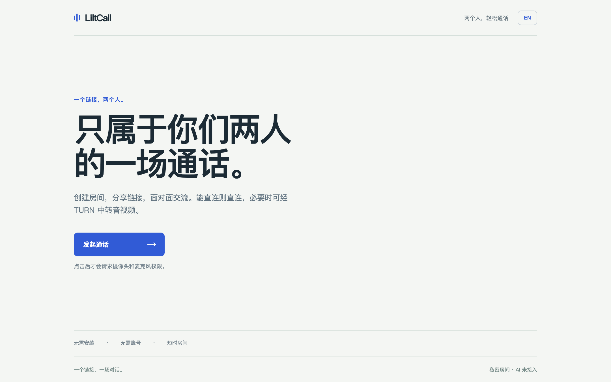
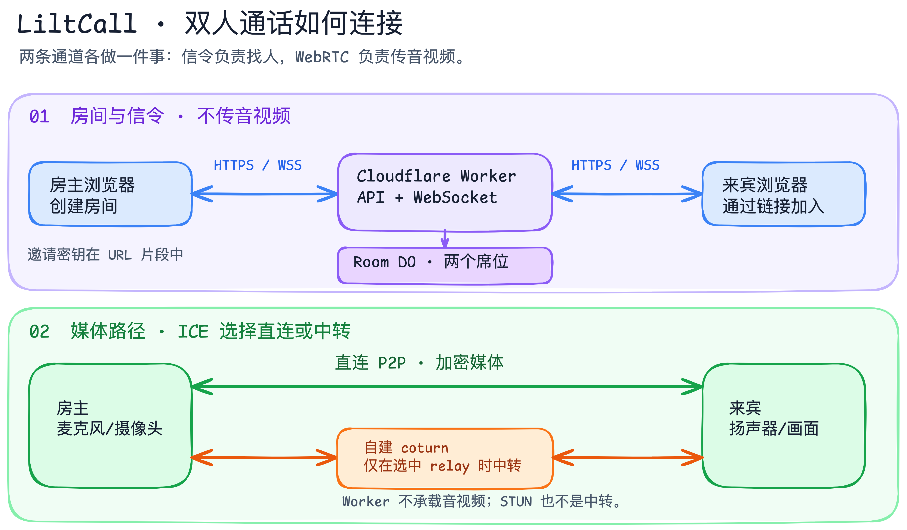

# LiltCall

> 一条链接，开启一场双人音视频通话。AI 只在用户明确进入独立模式时参与。

[体验测试站](https://liltcall.vercel.app/) · [本地运行](#本地运行) · [测试证据](docs/test-results.md) · [参与贡献](CONTRIBUTING.md) · [Apache-2.0 许可](LICENSE)



LiltCall 是一个无需注册、面向两人的浏览器 WebRTC 通话开源项目。房主创建短期房间并分享邀请链接，来宾点击加入。Cloudflare Worker 和 Room Durable Object 负责房间状态与信令；音视频由浏览器间的 WebRTC 传输，ICE 可选择直连，也可在网络不允许直连时使用自建 coturn 中转。

**当前仍是实验项目。** [网页测试站](https://liltcall.vercel.app/)和 [Worker 健康检查](https://liltcall-api.aimake.cc/healthz)已有部署，但不保证始终与本仓库最新提交同步。本机合成媒体的双向直连、强制 TURN/TCP 和移动尺寸 WebKit 测试通过；曾有手机来宾反馈能听到声音、看到画面。两台真机异网的双向真人语音、画面稳定性及口到耳延迟**尚未完成验收**，不能据此宣称所有网络都能接通。

## 一张图看懂



[编辑 Excalidraw 源图](docs/diagrams/call-path.excalidraw) · [查看 SVG](docs/diagrams/call-path.svg)

- **房间与信令：**双方经 HTTPS/WSS 访问 Worker；Room Durable Object 管理两个席位、会话与一次性 WebSocket 票据。邀请密钥放在 URL 片段中，Worker 不承载通话媒体。
- **媒体：**WebRTC 的 ICE 检查决定实际路径。选中直连候选时是 P2P；选中 relay 候选时，加密媒体包经过 coturn。STUN 只帮助发现地址，**不是**媒体中转。
- **可观察性：**连接详情显示候选、ICE 状态、实际选中路径、RTP 收包和浏览器提供的抖动/丢包等指标。ICE RTT 不是说话到听见的延迟；候选出现也不代表它被选中。

这里的“直连”是尽力争取，不是保证。用户不需要在同一个 Wi‑Fi；跨网络能否直连取决于双方 NAT、防火墙及网络策略。Worker 即使在 P2P 通话时也仍负责建房和信令。

## 能做什么

- 一条邀请链接完成建房、加入、离开与房主结束房间；最多两人，无账号。
- 点击创建或加入后才请求麦克风/摄像头权限；视频不可用时仍可尝试纯音频。
- 中英文界面可切换，语言偏好仅保存在各自浏览器；房间重入和短时信令恢复有自动化覆盖。
- 连接详情明确区分直连、中转和路径未知，不把 STUN 候选误报为成功直连。

目前没有录制、群聊或公开 AI 通话服务。截图使用合成摄像头画面和假麦克风，**不是**真人通话证明：[加入前检查](docs/screenshots/prejoin-zh.png) · [等待界面](docs/screenshots/waiting-zh.png) · [本地已接通](docs/screenshots/local-call-zh.png) · [手机尺寸预览](docs/screenshots/mobile-prejoin-zh.png)。

## 本地运行

需要 Node.js 22+、npm，以及支持摄像头/麦克风的浏览器。在仓库根目录安装依赖，然后分别启动 API 和网页：

```bash
npm ci
npm run dev:edge
```

```bash
npm run dev:web
```

用两个独立浏览器配置文件打开 `http://127.0.0.1:5187`；本地 Worker 在 `http://127.0.0.1:8787`。默认只提供 STUN，适合同机直连开发。需要验证中转时，按 [coturn 配置模板](deploy/coturn/turnserver.conf.example)设置服务器，并在被忽略的 `apps/edge/.dev.vars` 中配置自己的 `COTURN_HOST` 与全新 `COTURN_AUTH_SECRET`，参考 [变量示例](apps/edge/.dev.vars.example)。两端的 TURN 共享密钥必须一致；不要放进网页构建、Git 或公开日志。

默认 [Wrangler 配置](apps/edge/wrangler.jsonc)只用于本地开发，不绑定作者的线上域名。自行部署时，复制 [生产模板](apps/edge/wrangler.production.example.jsonc)为被忽略的 `apps/edge/wrangler.production.jsonc`，替换 Worker 名称、两个示例域名和 Cloudflare 速率限制命名空间，配置新的 Worker Secrets，再明确执行：

```bash
npx wrangler deploy --config apps/edge/wrangler.production.jsonc
```

静态网页需另行部署：构建前将 `VITE_API_BASE_URL` 设为自己的 Worker 地址，并让 Worker 的 `APP_ORIGIN` 等于网页来源域名；具体见 [部署摘要](docs/deployment-2026-09-23.md)。线上自托管 TURN 会消耗服务器带宽，不是“免费直连”。

## 验证

```bash
npm run check
npm test
npm run build
npx playwright install chromium webkit
npm run test:e2e
```

浏览器端到端测试使用独立上下文、合成音视频和本地 Worker，覆盖双向 RTP、画面解码、房间权限、重入、信令重连及中英文界面。2026-09-24 的开源首发候选在本机为 **34 通过、1 项按 TURN 凭据配置跳过**；[GitHub CI](https://github.com/chicogong/liltcall/actions)也通过了该提交的 Linux E2E。若本机已安装 coturn，可运行 `npm run test:relay:local` 验证临时回环服务器上的强制中转。生产冒烟命令 `npm run smoke:production`、`npm run test:relay:production` 和 `npm run test:relay:production:tcp` 会创建公网测试房间，**不要**把它们当作普通本地测试反复执行。

这些测试不能代替不同真实设备/网络上的双向真人验收。[完整测试结果与证据边界](docs/test-results.md) · [指标和手工验收方案](docs/test-plan.md)。

## 独立的 AI 语音原型

`apps/web/ai.html` 与 `apps/ai` 是**私有的一人对 AI 原型**，不属于上述双人房间，也没有公网 AI 入口。浏览器把音频通过 WebRTC 送到作为另一个端点的 Pipecat 服务；本地路径可使用 Whisper → Ollama/Qwen → Pocket TTS，另有需显式费用开关的腾讯云 ASR/TTS 与硅基流动 LLM 适配器。流式 ASR/TTS 目前只有离线协议测试，不能宣称真实服务商首包延迟或公开可用。双人通话不会自动把声音发给 AI。

[AI 架构图与代码边界](docs/ai-code-architecture.md) · [可编辑源图](docs/diagrams/ai-streaming-architecture.excalidraw) · [本地运行](docs/ai-local-spike.md) · [流式测试边界](docs/ai-streaming.md) · [延迟定义](docs/ai-latency.md)。

未来若让 AI 加入**双人**通话，必须显式改变媒体拓扑并取得双方同意；仅增加一个 LLM API 端点无法听到现有的端到端 P2P 媒体。

## 仓库导航与隐私

| 位置 | 用途 |
| --- | --- |
| `apps/web` | 双人通话 UI、中文/英文文案、连接诊断；`ai.html` 是独立原型入口 |
| `apps/edge` | Worker API、Room Durable Object、短期 TURN 凭据和信令 |
| `packages/protocol` | 房间状态与信令协议 |
| `apps/ai` | 私有 Pipecat 原型与 AI 适配器；普通网页部署不包含它 |
| `deploy/coturn` | 自建 TURN 示例与资源限制 |
| `tests`、`docs` | 自动化、截图、可编辑架构图、测试和部署边界 |

真人通话路径不主动录制或存储通话内容，但服务端仍保存短期房间状态、哈希凭据与信令票据；房间关闭/过期后，持久化数据计划约 24 小时后清理，**不是立即删除**。托管平台和 TURN 服务可能另有网络日志。若未来启用 AI，必须明确告知音频会进入 AI 服务及其供应商。详见 [安全报告渠道](SECURITY.md)、[代码路径核对](docs/code-review-2026-09-23.md)与 [Apache-2.0 许可证](LICENSE)。
