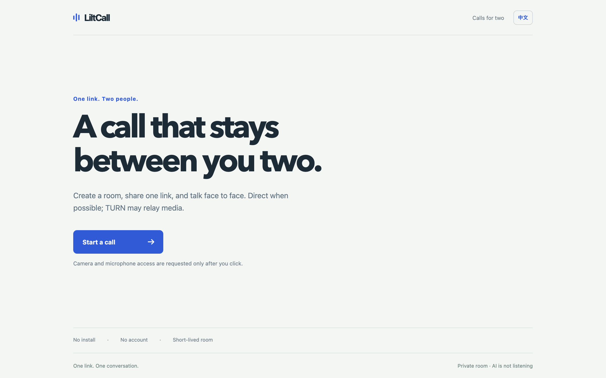
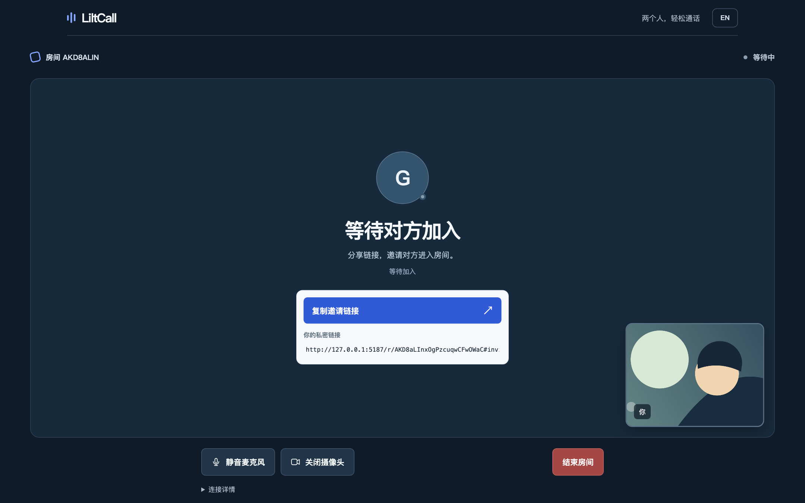
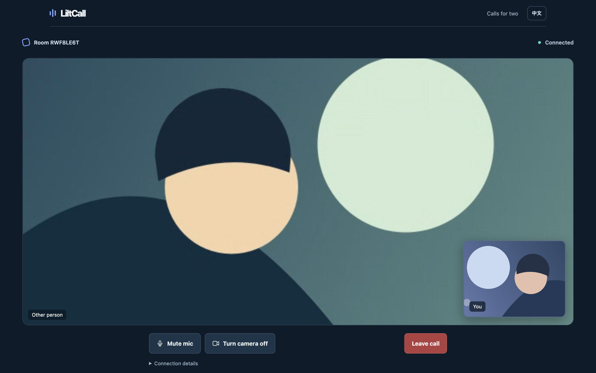
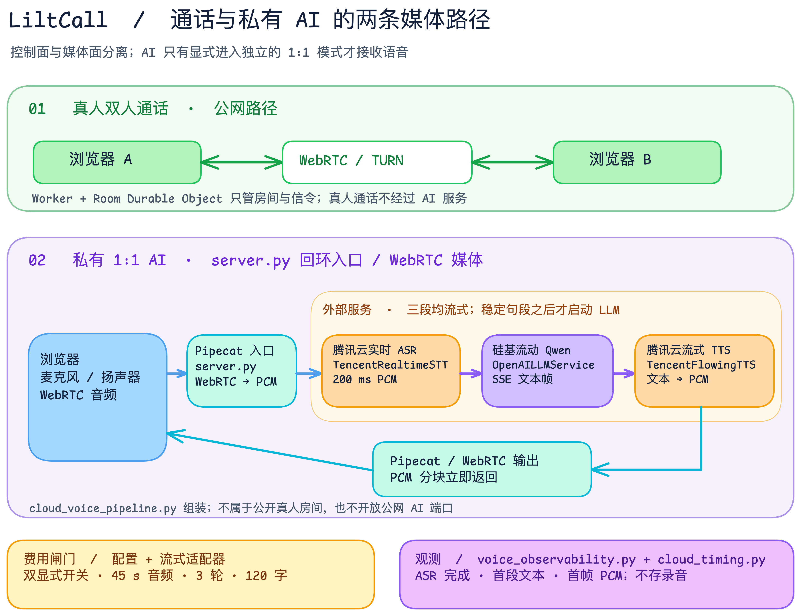

# LiltCall

> One link. One conversation. AI only when invited.

[Live test site](https://liltcall.vercel.app/) · [Run locally](#run-locally) · [Architecture](#architecture-at-a-glance) · [Test evidence](docs/test-results.md) · [Contributing](CONTRIBUTING.md) · [Apache-2.0 license](LICENSE)



LiltCall is an account-free, ephemeral audio/video-call reference project: create a short-lived room, share its link, and talk in the browser. The Worker and Durable Object handle room state and signaling. WebRTC uses a direct path when selected, or a bounded self-hosted TURN fallback. A separate **private one-human/one-AI voice prototype** sends microphone audio over WebRTC to Pipecat and can return locally generated or opt-in cloud speech. It is not part of the deployed human-call site.

**Status: experimental.** The [public web UI](https://liltcall.vercel.app/) and [Worker API](https://liltcall-api.aimake.cc/healthz) are deployed. Automated calls using synthetic media passed both direct and forced-TURN paths, including TURN/TCP; a phone guest previously confirmed receiving audio/video over relay. Two-way human speech and video across two real networks, perceived latency, and reliability remain unverified. See the [test evidence](docs/test-results.md) and [deployment summary](docs/deployment-2026-09-23.md).

## Architecture at a glance


_Public test-site architecture. The Worker and Durable Object handle room membership, signaling and temporary TURN credentials, not audio/video. ICE selects the media route; direct and forced-relay synthetic-media tests passed, while a two-way call between real devices on different networks remains unverified. [Edit this Excalidraw diagram](docs/diagrams/call-path.excalidraw) · [Human-call details](#human-call-path) · [Test evidence](docs/test-results.md)._

## Why LiltCall?

- **One-link flow, no account:** create, copy an invitation, join. Camera and microphone access are requested only after a deliberate click.
- **Direct or relay, visibly:** the Worker handles HTTPS/WSS signaling and room state and issues short-lived coturn credentials only to authenticated room members. WebRTC tries available ICE paths and the UI shows the selected direct or relay route. TURN carries encrypted WebRTC media packets when selected; the Worker does not carry media. ICE is not guaranteed to pick direct just because direct is reachable.
- **Short-lived by design:** two seats, expiring rooms, host-controlled close, hashed room credentials, and one-use WebSocket tickets. The invite secret lives in the URL fragment rather than the request path.
- **Failures you can inspect:** Connection details show ICE state, host/public/relay candidate event counts, current ICE candidate-pair and remote-candidate stats, connectivity checks and replies in both directions when the browser reports them, ICE-server/candidate error counts, retry count, the selected route, and first observed audio/video RTP. They also show selected ICE-pair RTT and inbound audio/video received and lost packet counts, jitter, and video freezes where supported. If stats omit the selected-pair ID, the UI checks the browser's actual selected ICE pair; if neither API identifies it, the UI says route stats are unavailable instead of guessing from gathered candidates. ICE RTT is **not** mouth-to-ear latency; stream counters can reset. Unsupported fields appear as “—”, not a misleading zero. These diagnostics do not expose candidate IPs or the invite secret. Local tests cover authorization, rejoin, signaling loss, and bidirectional media.
- **AI has a visible boundary:** the private `/ai.html` prototype requires a separate click and service; human calls do not send speech to it. The remote AI process was tested through a private tunnel and stopped afterward. A public AI mode will require authentication, consent, abuse/cost controls, and its own deployment.

These are design and current-code advantages, not measured claims of global reliability, lower latency, or absolute privacy. [GhostCall](https://www.ghostcall.space/) informed the product flow; no GhostCall code is used here.

## Current local experience

1. Start a call, check the camera and microphone, then create the room. Back leaves the setup without creating one.
2. Share the invitation link while waiting; the guest checks their camera and microphone before joining.
3. Talk face to face, mute or switch off the camera, open connection details if needed, and end the room. If the camera is unavailable, audio can still work.
4. A short signaling interruption can recover; a closed or expired link cannot revive the room.

The MVP has no account, recording, persistent transcript, or group call. The browser requests camera/microphone access only after a create/join click. The host can end the room; the guest can leave it. Relay works in automated tests and carried audio/video to one user-reported real iPhone; two-way human speech remains unverified. [Pre-join camera/mic check](docs/screenshots/prejoin.png) · [Host waiting with an invite link](docs/screenshots/waiting.png).

## 中文界面 / Chinese UI

浏览器语言为中文时默认显示简体中文，也可随时用右上角的 `中文 / EN` 按钮切换；手动选择会保存在本机浏览器。两端可分别使用中文或英文，邀请链接不包含语言偏好。建房、加入、通话状态、连接诊断、摄像头/麦克风权限及错误提示均已本地化。中文版已部署；同机模拟设备的直连与中转测试通过。另一次用户从手机加入时，Mac 模拟设备房主端 ICE `connected`、路径 `relay`，用户确认手机上有声音和画面；用户此前说明使用 iPhone Chrome/蜂窝数据，但本次未重新核验网络类型，双向真人语音尚未验收。



[中文首页](docs/screenshots/landing-zh.png) · [中文摄像头/麦克风检查](docs/screenshots/prejoin-zh.png) · [中文已接通界面](docs/screenshots/local-call-zh.png) · [中文手机预览](docs/screenshots/mobile-prejoin-zh.png)



_Local simulation: both browser contexts received audio and video RTP over direct P2P. The pictured media is synthetic illustration, not a person or a real camera. This does not prove human audibility, real camera quality, or public-network connectivity._

## Run locally

Requires Node.js 22+, npm, and a browser with camera/microphone access. In two terminals from this repository:

```bash
npm install
npm run dev:edge
```

```bash
npm run dev:web
```

Open `http://127.0.0.1:5187` in two browser profiles on the same computer. The local API is `http://127.0.0.1:8787`. Without a TURN configuration, it returns STUN only. For a self-hosted TURN server, set `COTURN_HOST` and a fresh 64-character hex `COTURN_AUTH_SECRET` in the ignored `apps/edge/.dev.vars`; see the [example](apps/edge/.dev.vars.example) and [coturn config template](deploy/coturn/turnserver.conf.example). The same secret must be configured on coturn and only in the Worker, never in the web build or Git. The Worker signs per-request TURN REST credentials valid for 2 hours plus 10 minutes, matching the room cap with margin. The optional Cloudflare Realtime TURN provider remains supported via `TURN_KEY_ID` and `TURN_KEY_API_TOKEN`, but is not used by this deployment. An incomplete TURN configuration returns 503 instead of silently claiming relay support. Never reuse the historical `WebRTC-p2p` credentials.

The default [Wrangler config](apps/edge/wrangler.jsonc) is for local development and does not bind the original author's API domain. To deploy your own Worker, copy [the production example](apps/edge/wrangler.production.example.jsonc) to ignored `apps/edge/wrangler.production.jsonc`, replace both example domains and the Worker name, configure fresh TURN secrets, then deploy deliberately with `npx wrangler deploy --config apps/edge/wrangler.production.jsonc`. Use your own web origin for `APP_ORIGIN`; do not commit real secrets or your private production config. The example's rate-limit namespace is illustrative and must be checked against your Cloudflare account.

```bash
npm run check
npm test
npm run test:e2e
npm run build
```

Install both browser engines first with `npx playwright install chromium webkit`. E2E tests use fake camera/microphone devices, separate browser contexts, a local Wrangler Worker, and check inbound audio/video RTP and rendered video frames—including an iPhone-sized WebKit guest opposite a Chromium host. This does not test a real iPhone or human audibility. Automated tests use a separate local Wrangler config with a 100/minute room-creation limit; the deployed Worker remains at 20/minute per IP/location. See the [test plan](docs/test-plan.md) and [latest local evidence](docs/test-results.md).

After a deployment, run `npm run smoke:production` manually. It creates and closes one room on the public site, then checks two fake-device browser contexts for direct audio/video. It does not replace a real two-device, cross-network test; avoid running it repeatedly enough to hit the room-creation limit.

After configuring fresh local TURN secrets, run `npm run test:relay`. This test forces `iceTransportPolicy: "relay"` in two local Chromium contexts and requires bidirectional audio/video RTP plus a selected `relay` route. It is skipped by the ordinary E2E suite when credentials are absent; passing it still does not prove real iPhone or cellular connectivity. `npm run test:relay:production` exercises the deployed site and TURN server with fake devices; `npm run test:relay:production:tcp` additionally restricts TURN to TCP. Each creates and closes one public room.

For an offline integration check, install `coturn` from Homebrew and run `npm run test:relay:local`. Playwright starts a loopback-only coturn process, and the local Worker signs real short-lived test credentials for it. It verifies relayed media between two local browser contexts but does **not** test a public network. No background coturn service is started by this command.

### Local one-to-one AI voice prototype

The isolated [AI setup and test guide](docs/ai-local-spike.md) explains the no-key audio probe and the fully local Whisper → Ollama/Qwen2.5 → Pocket TTS path. An [opt-in cloud adapter](docs/ai-cloud-spike.md) connects Tencent Cloud ASR/TTS and SiliconFlow Qwen behind an explicit billing gate. This is a separate private prototype: [a controlled remote experiment](docs/ai-private-stage-2026-09-24.md) completed one synthetic voice loop, but there is no public AI endpoint or running AI service. Open `http://127.0.0.1:5187/ai.html` only after starting a local service or controlled private tunnel and Vite. `npm run test:ai` checks the no-model audio path; real-provider tests require separate credential, quota, and billing review.

To regenerate the six English and six Chinese UI screenshots, start `npm run dev:edge` and `npm run dev:web`, then run `node tests/capture-readme.mjs`. The script uses isolated Chromium contexts per language, synthetic camera illustration, and a fake microphone; it ends each local room after capture. [Mobile pre-join](docs/screenshots/mobile-prejoin.png) · [Mobile waiting room](docs/screenshots/mobile-waiting.png). Do not use these images as evidence of a production call.

The [AI latency note](docs/ai-latency.md) separates API request times, LLM first text, server first audio frame, and browser-observed RTP. Existing samples are single calls, not p50/p95 or human mouth-to-ear latency. An isolated [streaming cloud mode](docs/ai-streaming.md) has **only offline protocol tests**, not a real-provider call or deployment. This source is licensed under [Apache-2.0](LICENSE); the [release review](docs/release-readiness-2026-09-24.md) records what was verified and what still needs real-device testing.

The [AI code architecture](docs/ai-code-architecture.md) separates the deployed human call from the private one-human/one-AI prototype and maps the shared cloud pipeline versus its batch and streaming adapters.



_Private prototype architecture, not the public site's media path. The streaming cloud adapters shown here have passed offline protocol tests only; they have not completed a real-provider streaming call or public deployment. [Edit this Excalidraw diagram](docs/diagrams/ai-streaming-architecture.excalidraw) · [Read the code architecture](docs/ai-code-architecture.md)._

The earlier `?ice=relay` diagnostic flag is ignored; use the selected route in Connection details to determine whether media is direct or relayed. The Worker supplies STUN endpoints and short-lived TURN credentials. ICE may retry after failure, and signaling reconnection may re-offer. A candidate being gathered does not prove the path was selected or usable; see the [real-device acceptance checklist](docs/test-plan.md#手工矩阵与步骤).

## Human call path

The human path is browser A ↔ browser B WebRTC audio/video, directly or through self-hosted TURN when ICE selects relay. STUN discovers addresses but does not relay media.

| Mode | Media route | Backend role | Status |
|---|---|---|---|
| Human-only | Browser ↔ browser WebRTC audio/video, direct or TURN-relayed | Worker + Room Durable Object manage membership/signaling; Worker issues temporary TURN credentials; TURN relays media when selected | Public synthetic-media direct and forced-relay calls passed; one phone guest reported receiving audio/video over relay; two-way human media and network reliability remain unverified |
| One human + AI, local prototype | Browser ↔ Pipecat over loopback WebRTC audio | Local Whisper STT → Ollama/Qwen2.5 LLM → Pocket TTS | Local automated end-to-end smoke passed; not deployed or production-ready |
| One human + AI, opt-in cloud prototype | Browser ↔ Pipecat WebRTC audio; local loopback or private tunneled signaling to server | Tencent Cloud sentence ASR → SiliconFlow Qwen → Tencent Cloud TTS | Local and private-server browser audio smokes passed; remote synthetic fixture took ~94 s and is not a live latency benchmark; no public AI endpoint or real-device proof |
| Two humans + AI | Humans ↔ SFU ↔ AI audio ingress/egress | Explicitly authorized AI runtime receives speech and publishes a reply track | Future design; provider to validate |

An AI bot cannot hear a private two-person P2P call merely by adding an API endpoint. The media topology must change or the bot must become a WebRTC peer. **One human + AI does not need an SFU**: the AI service itself is the other WebRTC endpoint, as in the local prototype. Two humans + AI remains a separate, unimplemented design that would require everyone’s consent.

For **text-in/TTS-out only**, a backend can generate speech and send it to clients over HTTPS/WebSocket; that does not require STT or an SFU. Conversational AI listening to live speech does.

## Test deployment and planned release

| Component | Candidate |
|---|---|
| Web UI | [Vercel test URL](https://liltcall.vercel.app/); TURN-capable build deployed |
| Room API and signaling | [Cloudflare Worker custom domain](https://liltcall-api.aimake.cc/healthz) + one Durable Object per room; tested from the development network |
| NAT fallback | Self-hosted coturn; forced public relay and one user-reported phone reception passed; broader real-device validation pending |
| Local one-to-one AI prototype | Pipecat SmallWebRTC and local models on the development Mac; no public endpoint |
| Private cloud-AI staging | One controlled Mac ↔ remote AI WebRTC probe and cloud voice smoke passed; service stopped, no public endpoint |
| Optional future two-human-plus-AI mode | SFU plus an authorized voice-agent runtime; compare Cloudflare Realtime SFU and LiveKit before choosing |

The Worker is still necessary for human-room state and signaling, even when media is P2P. One user-reported phone reception is not a measured success rate or a two-way human call. The deployed Worker and coturn use rate/resource limits, but these are abuse brakes, **not** a global cost cap or availability guarantee. See the [deployment summary](docs/deployment-2026-09-23.md) and [acceptance plan](docs/test-plan.md).

### Self-hosted TURN operations

1. On a dedicated or shared server, install coturn and adapt the [config template](deploy/coturn/turnserver.conf.example) to its public/private IP mapping. Generate a **new random 32-byte hex secret**. Keep the configured secret readable only by coturn; do not reuse old `WebRTC-p2p` keys. Apply the [systemd resource limits](deploy/coturn/limits.conf) if it shares a host with other services.
2. Open only the TURN listener and relay port range that match your own configuration. Store `COTURN_HOST` and `COTURN_AUTH_SECRET` as Worker Secrets, not Vercel variables or Git content. An authenticated `/v1/rooms/:id/ice-servers` response should contain temporary credentials; unauthenticated requests must be rejected.
3. Run `npm run test:relay:local`, then `npm run test:relay:production`, `npm run test:relay:production:tcp`, and `npm run smoke:production`. The public tests passed with fake devices on 2026-09-23. One user-reported phone guest subsequently heard sound and saw video over relay from a synthetic Mac host; the network type was not rechecked. Complete the remaining two-way human-audio/video check on separate real devices and collect anonymized diagnostics, without sharing invitation links. The server is already prepaid, **not free infrastructure**: confirm renewal and monitor resource/bandwidth use before wider publication.

## Architecture and research

- [Test matrix, metric definitions and stop conditions](docs/test-plan.md) (Chinese)
- [Local test evidence and remaining gaps](docs/test-results.md) (Chinese)
- [Code map, lifecycle fixes and remaining boundaries](docs/code-review-2026-09-23.md) (Chinese)
- [One-to-one AI local prototype and reproducible tests](docs/ai-local-spike.md) (Chinese)
- [AI code architecture and streaming media boundaries](docs/ai-code-architecture.md) (Chinese)
- [Local release readiness, secret and third-party review](docs/release-readiness-2026-09-24.md) (Chinese)
- [Contribution guide](CONTRIBUTING.md) · [Security reporting policy](SECURITY.md) · [Apache-2.0 license](LICENSE)

The older [chicolabs/WebRTC-p2p](https://github.com/chicolabs/WebRTC-p2p/tree/master) is background for the WebRTC offer/answer/ICE flow, not production code to copy: its historical certificate, static TURN credentials, and connection lifecycle require a new implementation. This recovery pass followed the [WebRTC peer-connection guide](https://webrtc.org/getting-started/peer-connections), [ICE-restart behavior](https://developer.mozilla.org/en-US/docs/Web/API/RTCPeerConnection/restartIce), and [ICE error semantics](https://developer.mozilla.org/en-US/docs/Web/API/RTCPeerConnection/icecandidateerror_event), and compared the candidate/error handling in the MIT-licensed [simple-peer](https://github.com/feross/simple-peer) project; no source code was copied.

## Roadmap and contribution boundary

| Milestone | Deliverable | Evidence gate |
|---|---|---|
| M0 | Protocol, state machine, diagrams, threat model | Core protocol and authorization tests implemented; threat model remains to formalize |
| M1 | Local two-browser audio/video call | Fake-device bidirectional audio/video RTP, decoded video, camera/mic controls, close and authorization tests pass; real-device validation pending |
| M2 | Public-network validation | Fresh TURN key, verified relay-only control call, cross-network Mac/iPhone bidirectional audio/video and selected-route evidence; report failure clearly if all paths fail |
| M3 | Open-source launch | One-command local run, reproducible deployment, privacy notes, test matrix, English-first docs, issue templates and CI |
| M4 | Optional AI voice spike | Local speech-in/reply-out automated smoke implemented; interruption, latency distribution, cost/privacy and public deployment remain open |

The intended public positioning is **a small, inspectable two-person audio/video-call reference with an optional AI seam**, not another full video-meeting suite. The source repository is `chicogong/liltcall`; the project owner selected Apache-2.0. No third-party project source code was copied into this repository.

## Privacy claim, carefully scoped

The human-only design does not intentionally record or store call content, but room state and network metadata exist. The Room Durable Object retains hashed room credentials and short-lived signaling tickets until consumption, expiration, or cleanup; closed/expired room storage is scheduled for deletion around 24 hours later, not instantly. Hosting and TURN infrastructure may have separate network logs. If AI is enabled, selected audio is intentionally sent to the AI media/model path; everyone in the room must see that state and authorize it. Transport encryption alone does not make an SFU or AI processor unable to access audio. Actual provider disclosures must be checked against each deployment.
